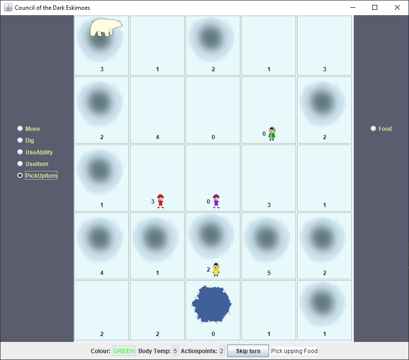

# IceField (Projekt Laboratorium)

## About the projekt

IceField is a turn-based survival strategy game, based on a board-game. 

Your goal is to survive on an ice field, find all parts of a flare gun, in order to signal your location to the rescue team. The players either play as an eskimo or as a researcher, and have to work together in order to survive.

This was made by 5 students at BME-VIK for as a class submission.
